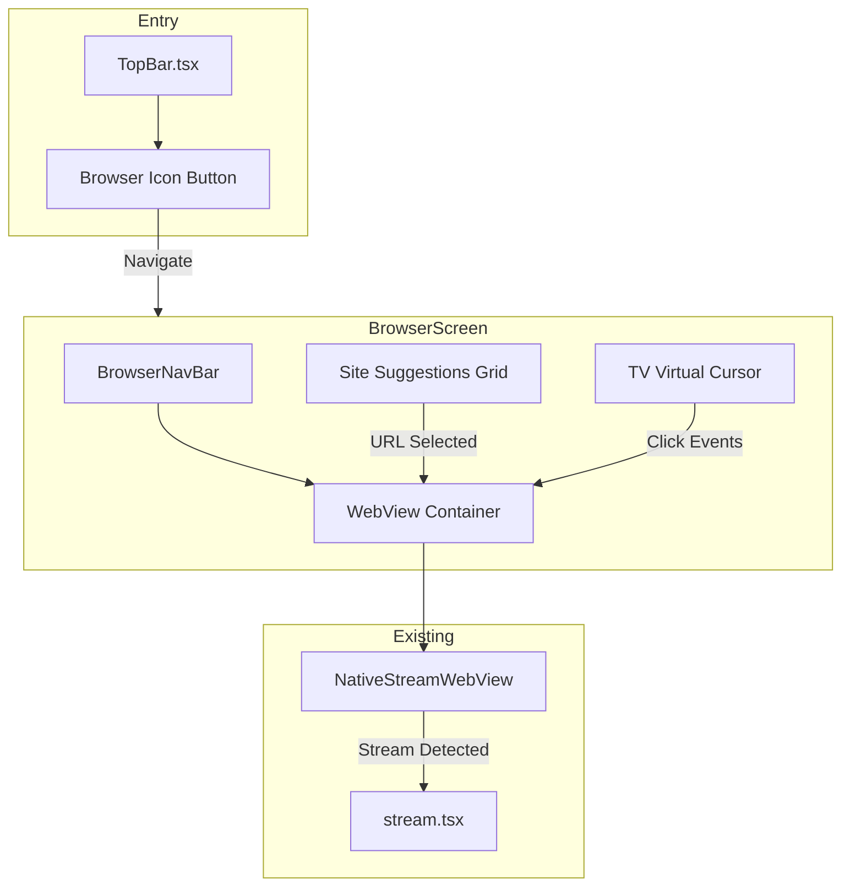
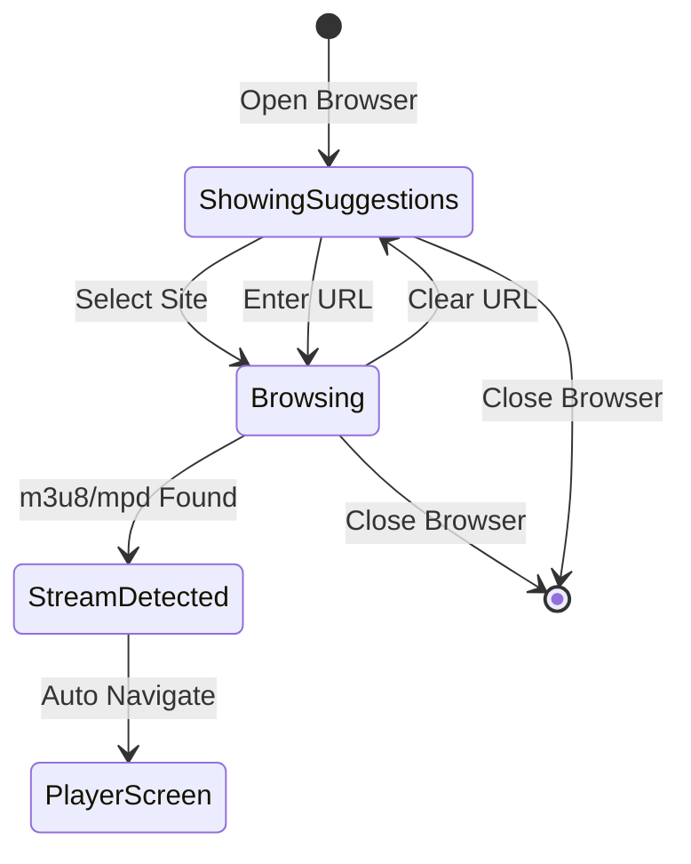
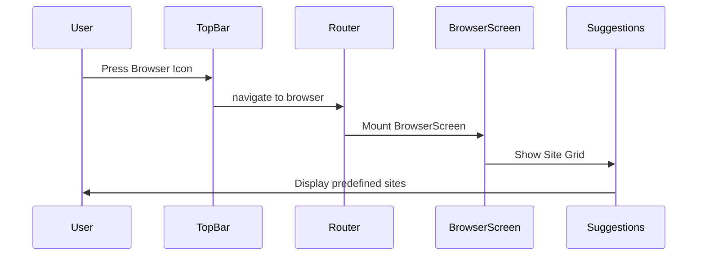
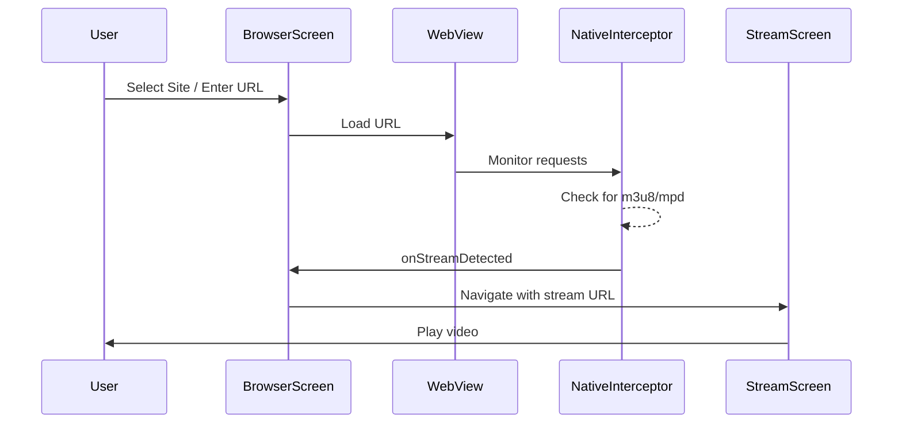
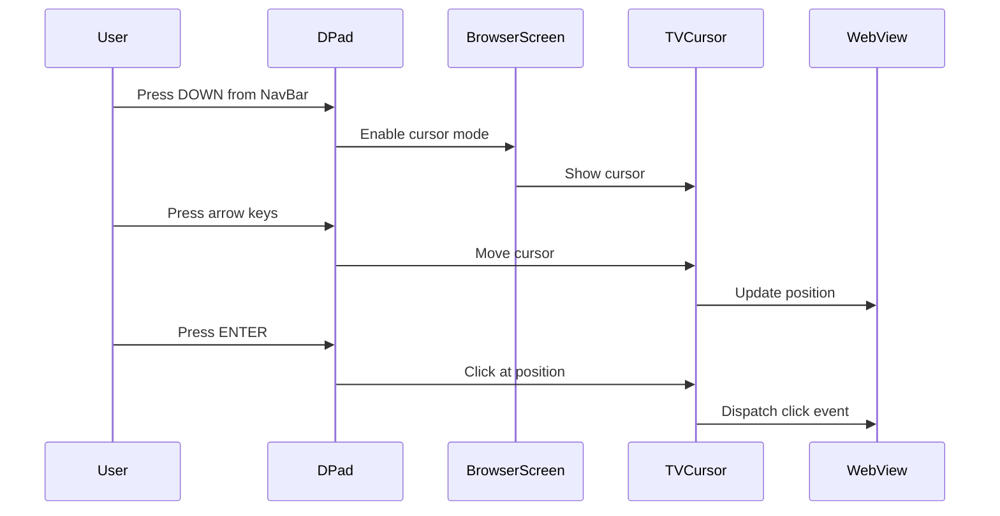

# Browser Mode Feature - Technical Specification

## Overview

This document provides a comprehensive technical specification for implementing a Browser Mode feature in the H5TV app. The feature allows users to browse websites and automatically intercept media streams (m3u8/mpd) for playback in the native player.

## Table of Contents

1. [Feature Requirements](#feature-requirements)
2. [Architecture Overview](#architecture-overview)
3. [Component Hierarchy](#component-hierarchy)
4. [File Structure](#file-structure)
5. [State Management](#state-management)
6. [TV Navigation & Virtual Cursor](#tv-navigation--virtual-cursor)
7. [Integration Points](#integration-points)
8. [Implementation Details](#implementation-details)
9. [Predefined Sites Configuration](#predefined-sites-configuration)
10. [User Flow Diagrams](#user-flow-diagrams)

---

## Feature Requirements

### Functional Requirements

1. **Entry Point**: Browser icon next to the search input in TopBar
2. **Browser Screen**: Full-screen browser with navigation controls
3. **Site Suggestions**: Grid of predefined streaming sites shown initially
4. **Stream Detection**: Automatic m3u8/mpd interception via existing NativeStreamWebView
5. **TV Navigation**: D-Pad support with virtual cursor for Android TV
6. **Hardware Back**: Navigate back in browser history or exit browser

### Non-Functional Requirements

1. **Performance**: Smooth cursor movement at 60fps on TV devices
2. **Accessibility**: Clear visual focus indicators
3. **Responsiveness**: Adapt to different screen sizes (720p, 1080p, 4K)

---

## Architecture Overview



---

## Component Hierarchy

```
app/
├── browser.tsx                    # Main browser screen (Expo Router)
│
src/components/
├── browser/
│   ├── BrowserNavBar.tsx         # Navigation bar with URL, back, reload
│   ├── BrowserWebView.tsx        # WebView wrapper with cursor integration
│   ├── SiteSuggestionsGrid.tsx   # Grid of predefined sites
│   ├── SiteCard.tsx              # Individual site card component
│   └── TVCursor.tsx              # Virtual cursor for TV navigation
│
├── TopBar.tsx                    # Modified - add browser icon
```

### Component Details

#### 1. `app/browser.tsx`
Main screen component using Expo Router.

**Responsibilities:**
- Manage browser state (URL, loading, canGoBack, canGoForward)
- Handle hardware back button
- Coordinate between nav bar, webview, and site suggestions
- Handle stream detection and navigation to player

**Props:** None (receives route params via `useLocalSearchParams`)

#### 2. `BrowserNavBar.tsx`
Top navigation bar for browser controls.

**Props:**
```typescript
interface BrowserNavBarProps {
  url: string;
  pageTitle: string;
  isLoading: boolean;
  canGoBack: boolean;
  canGoForward: boolean;
  onBack: () => void;
  onForward: () => void;
  onReload: () => void;
  onClose: () => void;
  onUrlSubmit: (url: string) => void;
  onFocusChange?: (focused: boolean) => void;
}
```

#### 3. `BrowserWebView.tsx`
WebView wrapper that integrates with TV cursor.

**Props:**
```typescript
interface BrowserWebViewProps {
  url: string;
  cursorPosition: { x: number; y: number } | null;
  onStreamDetected: (data: StreamData) => void;
  onLoadStart: () => void;
  onLoadEnd: (event: { url: string; title: string; canGoBack: boolean; canGoForward: boolean }) => void;
  onError: (error: string) => void;
  webViewRef: React.RefObject<NativeStreamWebViewRef>;
}
```

#### 4. `SiteSuggestionsGrid.tsx`
Grid overlay showing predefined streaming sites.

**Props:**
```typescript
interface SiteSuggestionsGridProps {
  visible: boolean;
  onSiteSelect: (site: PredefinedSite) => void;
  onClose: () => void;
}
```

#### 5. `SiteCard.tsx`
Individual site card in the suggestions grid.

**Props:**
```typescript
interface SiteCardProps {
  site: PredefinedSite;
  onPress: () => void;
  hasTVPreferredFocus?: boolean;
}
```

#### 6. `TVCursor.tsx`
Virtual cursor component for TV D-Pad navigation.

**Props:**
```typescript
interface TVCursorProps {
  visible: boolean;
  position: { x: number; y: number };
  onClick: () => void;
}
```

---

## File Structure

```
H5TV/
├── app/
│   ├── _layout.tsx              # Add browser route
│   ├── browser.tsx              # NEW: Browser screen
│   ├── index.tsx
│   └── stream.tsx
│
├── src/
│   ├── components/
│   │   ├── browser/             # NEW: Browser components folder
│   │   │   ├── index.ts         # Barrel exports
│   │   │   ├── BrowserNavBar.tsx
│   │   │   ├── BrowserWebView.tsx
│   │   │   ├── SiteSuggestionsGrid.tsx
│   │   │   ├── SiteCard.tsx
│   │   │   └── TVCursor.tsx
│   │   │
│   │   ├── TopBar.tsx           # MODIFY: Add browser icon
│   │   └── player/
│   │       └── NativeStreamWebView.tsx  # REUSE: Stream detection
│   │
│   ├── constants/
│   │   ├── Colors.ts
│   │   ├── PredefinedSites.ts   # NEW: Site configurations
│   │   └── BrowserConfig.ts     # NEW: Browser settings
│   │
│   ├── hooks/
│   │   ├── useTVCursor.ts       # NEW: TV cursor logic hook
│   │   └── useBrowserNavigation.ts  # NEW: Browser nav state hook
│   │
│   └── types/
│       └── browser.ts           # NEW: Browser-related types
```

---

## State Management

### Browser Screen State

```typescript
interface BrowserState {
  // URL & Navigation
  currentUrl: string;
  inputUrl: string;           // URL being typed in input
  pageTitle: string;
  canGoBack: boolean;
  canGoForward: boolean;
  
  // Loading
  isLoading: boolean;
  loadError: string | null;
  
  // UI State
  showSuggestions: boolean;   // Show site suggestions overlay
  navBarFocused: boolean;     // Is nav bar focused (affects cursor)
  
  // TV Cursor
  cursorEnabled: boolean;     // Is cursor mode active
  cursorPosition: {
    x: number;
    y: number;
  };
  
  // Stream Detection
  detectedStream: {
    url: string;
    headers: Record<string, string>;
  } | null;
}
```

### State Transitions



### Custom Hooks

#### `useTVCursor`
```typescript
interface UseTVCursorReturn {
  position: { x: number; y: number };
  isVisible: boolean;
  enable: () => void;
  disable: () => void;
  move: (direction: 'up' | 'down' | 'left' | 'right') => void;
  click: () => void;
  reset: () => void;
}

function useTVCursor(
  containerRef: React.RefObject<View>,
  options?: {
    speed?: number;           // Pixels per key press (default: 20)
    acceleration?: number;    // Speed multiplier for held keys
    bounds?: { width: number; height: number };
  }
): UseTVCursorReturn;
```

#### `useBrowserNavigation`
```typescript
interface UseBrowserNavigationReturn {
  url: string;
  title: string;
  canGoBack: boolean;
  canGoForward: boolean;
  isLoading: boolean;
  goBack: () => void;
  goForward: () => void;
  reload: () => void;
  navigate: (url: string) => void;
  webViewRef: React.RefObject<NativeStreamWebViewRef>;
}

function useBrowserNavigation(): UseBrowserNavigationReturn;
```

---

## TV Navigation & Virtual Cursor

### D-Pad Mapping

| Key | Action (Nav Bar Focused) | Action (Cursor Mode) |
|-----|-------------------------|---------------------|
| UP | Focus previous control | Move cursor up |
| DOWN | Focus next control / Enter cursor mode | Move cursor down |
| LEFT | Focus previous control | Move cursor left |
| RIGHT | Focus next control | Move cursor right |
| ENTER/SELECT | Activate focused control | Click at cursor position |
| BACK | Go back in history / Exit browser | Exit cursor mode / Go back |

### Cursor Implementation Strategy

#### Option A: JavaScript Injection (Recommended)
Inject JavaScript to handle cursor rendering and click simulation within the WebView.

```typescript
// Cursor injection script
const CURSOR_INJECTION_SCRIPT = `
  (function() {
    // Create cursor element
    const cursor = document.createElement('div');
    cursor.id = 'tv-cursor';
    cursor.style.cssText = \`
      position: fixed;
      width: 24px;
      height: 24px;
      border: 3px solid #00ff88;
      border-radius: 50%;
      pointer-events: none;
      z-index: 999999;
      transform: translate(-50%, -50%);
      box-shadow: 0 0 10px rgba(0, 255, 136, 0.5);
      transition: transform 0.1s ease-out;
    \`;
    document.body.appendChild(cursor);
    
    // Cursor state
    window.tvCursorX = window.innerWidth / 2;
    window.tvCursorY = window.innerHeight / 2;
    
    // Move cursor function (called from React Native)
    window.moveTVCursor = function(dx, dy) {
      window.tvCursorX = Math.max(0, Math.min(window.innerWidth, window.tvCursorX + dx));
      window.tvCursorY = Math.max(0, Math.min(window.innerHeight, window.tvCursorY + dy));
      cursor.style.left = window.tvCursorX + 'px';
      cursor.style.top = window.tvCursorY + 'px';
    };
    
    // Click at cursor position
    window.clickTVCursor = function() {
      const element = document.elementFromPoint(window.tvCursorX, window.tvCursorY);
      if (element) {
        // Visual feedback
        cursor.style.transform = 'translate(-50%, -50%) scale(0.8)';
        setTimeout(() => cursor.style.transform = 'translate(-50%, -50%)', 100);
        
        // Simulate click
        element.click();
        
        // Also dispatch events for React/Vue apps
        const clickEvent = new MouseEvent('click', {
          bubbles: true,
          cancelable: true,
          clientX: window.tvCursorX,
          clientY: window.tvCursorY
        });
        element.dispatchEvent(clickEvent);
      }
    };
    
    // Show/hide cursor
    window.showTVCursor = function(show) {
      cursor.style.display = show ? 'block' : 'none';
    };
    
    // Initial position
    window.moveTVCursor(0, 0);
  })();
`;
```

#### Option B: Native Overlay Cursor
Render cursor as a React Native View overlay and use `sendAccessibilityEvent` for clicks.

**Pros of Option A:**
- Cursor integrates with page scrolling
- Better hover effects on web elements
- More accurate click targeting

**Cons of Option A:**
- Script injection may be blocked by some sites
- Requires WebView JavaScript enabled

### Key Event Handling

```typescript
// In browser.tsx
useEffect(() => {
  const handleKeyDown = (event: { keyCode: number }) => {
    const { keyCode } = event;
    
    // D-Pad codes (Android TV)
    const DPAD_UP = 19;
    const DPAD_DOWN = 20;
    const DPAD_LEFT = 21;
    const DPAD_RIGHT = 22;
    const DPAD_CENTER = 23;
    const ENTER = 66;
    const BACK = 4;
    
    if (!cursorEnabled) {
      // Nav bar navigation mode
      return; // Let TVFocusable handle focus
    }
    
    // Cursor mode
    const CURSOR_SPEED = 20;
    switch (keyCode) {
      case DPAD_UP:
        moveCursor(0, -CURSOR_SPEED);
        break;
      case DPAD_DOWN:
        moveCursor(0, CURSOR_SPEED);
        break;
      case DPAD_LEFT:
        moveCursor(-CURSOR_SPEED, 0);
        break;
      case DPAD_RIGHT:
        moveCursor(CURSOR_SPEED, 0);
        break;
      case DPAD_CENTER:
      case ENTER:
        clickAtCursor();
        break;
      case BACK:
        if (cursorEnabled) {
          setCursorEnabled(false);
        } else if (canGoBack) {
          webViewRef.current?.goBack();
        } else {
          router.back();
        }
        break;
    }
  };
  
  const subscription = DeviceEventEmitter.addListener('onKeyDown', handleKeyDown);
  return () => subscription.remove();
}, [cursorEnabled, canGoBack]);
```

---

## Integration Points

### 1. TopBar Modification

**File:** `src/components/TopBar.tsx`

Add browser icon button next to search:

```typescript
// Add to TopBarProps
interface TopBarProps {
  // ... existing props
  onBrowserPress?: () => void;
  showBrowserIcon?: boolean;
}

// In JSX, add after search input:
{showBrowserIcon && (
  <TVFocusable
    onPress={onBrowserPress}
    style={styles.browserButton}
    focusedStyle={styles.browserButtonFocused}
  >
    {({ isFocused }) => (
      <Ionicons 
        name="globe-outline" 
        size={24} 
        color={isFocused ? Colors.primaryDark : Colors.text} 
      />
    )}
  </TVFocusable>
)}
```

### 2. Router Configuration

**File:** `app/_layout.tsx`

Add browser screen to stack:

```typescript
<Stack.Screen 
  name="browser" 
  options={{
    headerShown: false,
    animation: 'slide_from_right'
  }}
/>
```

### 3. Stream Detection Integration

**File:** `app/browser.tsx`

Reuse existing NativeStreamWebView:

```typescript
const handleStreamDetected = useCallback((data: { url: string; headers: StreamHeaders }) => {
  // Navigate to player with detected stream
  router.replace({
    pathname: '/stream',
    params: {
      name: pageTitle || 'Browser Stream',
      logo: '', // Could extract favicon
      urls: JSON.stringify([data.url]),
      fromBrowser: 'true'
    }
  });
}, [pageTitle, router]);
```

### 4. Home Screen Integration

**File:** `app/index.tsx`

Add browser navigation handler:

```typescript
const handleOpenBrowser = useCallback(() => {
  router.push('/browser');
}, [router]);

// Pass to TopBar
<TopBar 
  onSearchPress={handleOpenSearch}
  onBrowserPress={handleOpenBrowser}
  showBrowserIcon={true}
/>
```

---

## Implementation Details

### BrowserNavBar Component

```typescript
// src/components/browser/BrowserNavBar.tsx

import React, { useState, memo } from 'react';
import { View, TextInput, StyleSheet, Text } from 'react-native';
import Ionicons from '@expo/vector-icons/Ionicons';
import { TVFocusable } from '../TVFocusable';
import { Colors } from '../../constants/Colors';

interface BrowserNavBarProps {
  url: string;
  pageTitle: string;
  isLoading: boolean;
  canGoBack: boolean;
  canGoForward: boolean;
  onBack: () => void;
  onForward: () => void;
  onReload: () => void;
  onClose: () => void;
  onUrlSubmit: (url: string) => void;
  onFocusChange?: (focused: boolean) => void;
}

export const BrowserNavBar = memo(({
  url,
  pageTitle,
  isLoading,
  canGoBack,
  canGoForward,
  onBack,
  onForward,
  onReload,
  onClose,
  onUrlSubmit,
  onFocusChange
}: BrowserNavBarProps) => {
  const [inputValue, setInputValue] = useState(url);
  const [isEditing, setIsEditing] = useState(false);

  const handleSubmit = () => {
    let finalUrl = inputValue.trim();
    if (!finalUrl.startsWith('http://') && !finalUrl.startsWith('https://')) {
      finalUrl = 'https://' + finalUrl;
    }
    onUrlSubmit(finalUrl);
    setIsEditing(false);
  };

  return (
    <View style={styles.container}>
      {/* Close Button */}
      <TVFocusable
        onPress={onClose}
        style={styles.navButton}
        focusedStyle={styles.navButtonFocused}
        onFocus={() => onFocusChange?.(true)}
        onBlur={() => onFocusChange?.(false)}
      >
        {({ isFocused }) => (
          <Ionicons name="close" size={24} color={isFocused ? Colors.primaryDark : Colors.text} />
        )}
      </TVFocusable>

      {/* Back Button */}
      <TVFocusable
        onPress={onBack}
        disabled={!canGoBack}
        style={[styles.navButton, !canGoBack && styles.navButtonDisabled]}
        focusedStyle={styles.navButtonFocused}
        onFocus={() => onFocusChange?.(true)}
        onBlur={() => onFocusChange?.(false)}
      >
        {({ isFocused }) => (
          <Ionicons 
            name="arrow-back" 
            size={24} 
            color={canGoBack ? (isFocused ? Colors.primaryDark : Colors.text) : Colors.textMuted} 
          />
        )}
      </TVFocusable>

      {/* Forward Button */}
      <TVFocusable
        onPress={onForward}
        disabled={!canGoForward}
        style={[styles.navButton, !canGoForward && styles.navButtonDisabled]}
        focusedStyle={styles.navButtonFocused}
        onFocus={() => onFocusChange?.(true)}
        onBlur={() => onFocusChange?.(false)}
      >
        {({ isFocused }) => (
          <Ionicons 
            name="arrow-forward" 
            size={24} 
            color={canGoForward ? (isFocused ? Colors.primaryDark : Colors.text) : Colors.textMuted} 
          />
        )}
      </TVFocusable>

      {/* Reload Button */}
      <TVFocusable
        onPress={onReload}
        style={styles.navButton}
        focusedStyle={styles.navButtonFocused}
        onFocus={() => onFocusChange?.(true)}
        onBlur={() => onFocusChange?.(false)}
      >
        {({ isFocused }) => (
          <Ionicons 
            name={isLoading ? "close" : "reload"} 
            size={24} 
            color={isFocused ? Colors.primaryDark : Colors.text} 
          />
        )}
      </TVFocusable>

      {/* URL Input / Title Display */}
      <View style={styles.urlContainer}>
        {isEditing ? (
          <TextInput
            style={styles.urlInput}
            value={inputValue}
            onChangeText={setInputValue}
            onSubmitEditing={handleSubmit}
            onBlur={() => setIsEditing(false)}
            autoFocus
            selectTextOnFocus
            placeholder="Enter URL..."
            placeholderTextColor={Colors.textMuted}
            autoCapitalize="none"
            autoCorrect={false}
            keyboardType="url"
          />
        ) : (
          <TVFocusable
            onPress={() => setIsEditing(true)}
            style={styles.urlDisplay}
            focusedStyle={styles.urlDisplayFocused}
            onFocus={() => onFocusChange?.(true)}
            onBlur={() => onFocusChange?.(false)}
          >
            {({ isFocused }) => (
              <View style={styles.urlContent}>
                <Text 
                  style={[styles.urlText, isFocused && styles.urlTextFocused]} 
                  numberOfLines={1}
                >
                  {pageTitle || url || 'Enter URL or select a site'}
                </Text>
                {url && (
                  <Text style={styles.urlSubtext} numberOfLines={1}>
                    {url}
                  </Text>
                )}
              </View>
            )}
          </TVFocusable>
        )}
      </View>
    </View>
  );
});

const styles = StyleSheet.create({
  container: {
    flexDirection: 'row',
    alignItems: 'center',
    backgroundColor: Colors.surface,
    paddingHorizontal: 16,
    paddingVertical: 8,
    borderBottomWidth: 1,
    borderBottomColor: Colors.border,
    gap: 8,
  },
  navButton: {
    width: 44,
    height: 44,
    justifyContent: 'center',
    alignItems: 'center',
    borderRadius: 22,
    borderWidth: 2,
    borderColor: 'transparent',
  },
  navButtonFocused: {
    borderColor: Colors.primaryDark,
    backgroundColor: Colors.successLight,
  },
  navButtonDisabled: {
    opacity: 0.4,
  },
  urlContainer: {
    flex: 1,
    marginLeft: 8,
  },
  urlInput: {
    backgroundColor: Colors.focusBackground,
    borderRadius: 8,
    paddingHorizontal: 16,
    paddingVertical: 10,
    color: Colors.text,
    fontSize: 16,
  },
  urlDisplay: {
    backgroundColor: Colors.focusBackground,
    borderRadius: 8,
    paddingHorizontal: 16,
    paddingVertical: 8,
    borderWidth: 2,
    borderColor: 'transparent',
  },
  urlDisplayFocused: {
    borderColor: Colors.primaryDark,
    backgroundColor: Colors.successLight,
  },
  urlContent: {
    flexDirection: 'column',
  },
  urlText: {
    color: Colors.text,
    fontSize: 16,
    fontWeight: '500',
  },
  urlTextFocused: {
    color: Colors.primaryDark,
  },
  urlSubtext: {
    color: Colors.textMuted,
    fontSize: 12,
    marginTop: 2,
  },
});

BrowserNavBar.displayName = 'BrowserNavBar';
```

### SiteSuggestionsGrid Component

```typescript
// src/components/browser/SiteSuggestionsGrid.tsx

import React, { memo } from 'react';
import { View, ScrollView, StyleSheet, Text, Modal } from 'react-native';
import { SiteCard } from './SiteCard';
import { PREDEFINED_SITES, PredefinedSite } from '../../constants/PredefinedSites';
import { Colors } from '../../constants/Colors';
import { TVFocusable } from '../TVFocusable';
import Ionicons from '@expo/vector-icons/Ionicons';

interface SiteSuggestionsGridProps {
  visible: boolean;
  onSiteSelect: (site: PredefinedSite) => void;
  onClose: () => void;
}

export const SiteSuggestionsGrid = memo(({
  visible,
  onSiteSelect,
  onClose
}: SiteSuggestionsGridProps) => {
  if (!visible) return null;

  return (
    <Modal
      visible={visible}
      transparent
      animationType="fade"
      onRequestClose={onClose}
    >
      <View style={styles.overlay}>
        <View style={styles.container}>
          <View style={styles.header}>
            <Text style={styles.title}>Streaming Sites</Text>
            <TVFocusable
              onPress={onClose}
              style={styles.closeButton}
              focusedStyle={styles.closeButtonFocused}
            >
              {({ isFocused }) => (
                <Ionicons 
                  name="close" 
                  size={28} 
                  color={isFocused ? Colors.primaryDark : Colors.text} 
                />
              )}
            </TVFocusable>
          </View>
          
          <ScrollView 
            contentContainerStyle={styles.grid}
            showsVerticalScrollIndicator={false}
          >
            {PREDEFINED_SITES.map((site, index) => (
              <SiteCard
                key={site.id}
                site={site}
                onPress={() => onSiteSelect(site)}
                hasTVPreferredFocus={index === 0}
              />
            ))}
          </ScrollView>
        </View>
      </View>
    </Modal>
  );
});

const styles = StyleSheet.create({
  overlay: {
    flex: 1,
    backgroundColor: Colors.overlayMedium,
    justifyContent: 'center',
    alignItems: 'center',
  },
  container: {
    width: '80%',
    maxHeight: '80%',
    backgroundColor: Colors.surface,
    borderRadius: 16,
    padding: 24,
  },
  header: {
    flexDirection: 'row',
    justifyContent: 'space-between',
    alignItems: 'center',
    marginBottom: 20,
  },
  title: {
    color: Colors.text,
    fontSize: 24,
    fontWeight: 'bold',
  },
  closeButton: {
    width: 44,
    height: 44,
    justifyContent: 'center',
    alignItems: 'center',
    borderRadius: 22,
    borderWidth: 2,
    borderColor: 'transparent',
  },
  closeButtonFocused: {
    borderColor: Colors.primaryDark,
    backgroundColor: Colors.successLight,
  },
  grid: {
    flexDirection: 'row',
    flexWrap: 'wrap',
    justifyContent: 'space-between',
    gap: 16,
  },
});

SiteSuggestionsGrid.displayName = 'SiteSuggestionsGrid';
```

---

## Predefined Sites Configuration

```typescript
// src/constants/PredefinedSites.ts

export interface PredefinedSite {
  id: string;
  name: string;
  url: string;
  icon: string;           // Ionicons name
  color: string;          // Background color
  description?: string;
}

export const PREDEFINED_SITES: readonly PredefinedSite[] = [
  {
    id: 'youtube',
    name: 'YouTube',
    url: 'https://youtube.com',
    icon: 'logo-youtube',
    color: '#FF0000',
    description: 'Videos and Live Streams'
  },
  {
    id: 'globoplay',
    name: 'Globoplay',
    url: 'https://globoplay.globo.com',
    icon: 'play-circle',
    color: '#FF5F00',
    description: 'Globo Content'
  },
  {
    id: 'redecanais',
    name: 'Rede Canais',
    url: 'https://redecanais.do',
    icon: 'tv',
    color: '#4CAF50',
    description: 'Live TV Channels'
  },
  {
    id: 'vizer',
    name: 'Vizer',
    url: 'https://vizer.hair',
    icon: 'film',
    color: '#9C27B0',
    description: 'Movies and Series'
  },
  {
    id: 'embedinweb',
    name: 'Embed.in',
    url: 'https://embed-in.web.app',
    icon: 'videocam',
    color: '#2196F3',
    description: 'Stream Player'
  },
  {
    id: 'okru',
    name: 'OK.ru',
    url: 'https://ok.ru',
    icon: 'play',
    color: '#EE8208',
    description: 'Russian Streams'
  },
  {
    id: 'topflix',
    name: 'TopFlix Casa',
    url: 'https://top-flix.click/casa/',
    icon: 'home',
    color: '#E91E63',
    description: 'TopFlix Home'
  },
  {
    id: 'topflixhd',
    name: 'TopFlix HD',
    url: 'https://topflixhd.club',
    icon: 'sparkles',
    color: '#00BCD4',
    description: 'HD Content'
  }
] as const;
```

---

## User Flow Diagrams

### Opening Browser



### Browsing and Stream Detection



### TV Cursor Navigation



---

## Testing Considerations

### Unit Tests
- URL validation and normalization
- Stream detection logic
- Cursor position calculations

### Integration Tests
- Navigation between screens
- Stream detection callback flow
- Hardware back button handling

### E2E Tests (Android TV)
- D-Pad navigation through all controls
- Cursor movement and clicking
- Site suggestion selection
- Stream playback after detection

---

## Performance Optimizations

1. **Memoization**: All components use `memo()` to prevent unnecessary re-renders
2. **Debounced Cursor**: Cursor movement is debounced for smooth animation
3. **Lazy Loading**: Site icons loaded only when visible
4. **WebView Caching**: Enable cache for faster page loads

---

## Security Considerations

1. **URL Validation**: Sanitize user-entered URLs
2. **Content Policy**: Block known malicious domains
3. **JavaScript Injection**: Only inject trusted cursor script
4. **Cookie Isolation**: Browser cookies separate from app data

---

## Future Enhancements

1. **Bookmarks**: Save favorite sites
2. **History**: Browser history with search
3. **Tab Support**: Multiple browser tabs
4. **Picture-in-Picture**: PiP mode for detected streams
5. **Download Manager**: Download detected streams